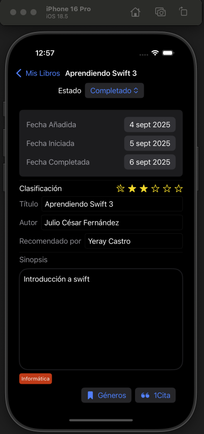
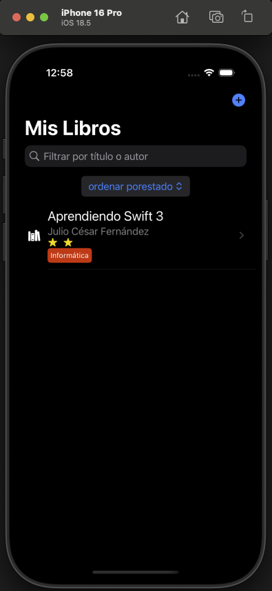

# iBooks

iBooks es una aplicación desarrollada en Swift utilizando el framework SwiftUI para la construcción de la interfaz y SwiftData como solución moderna de persistencia de datos. Su propósito es ofrecer una experiencia intuitiva y potente para la gestión de colecciones de libros, incorporando funcionalidades avanzadas de organización, personalización y seguimiento de lectura, todo ello mediante un enfoque nativo, sin dependencias externas, y aprovechando las últimas capacidades del ecosistema Apple.

La aplicación permite al usuario crear y administrar su biblioteca personal, ofreciendo herramientas para filtrar, ordenar, clasificar y detallar cada libro con información adicional, como sinopsis, estado de lectura, género y citas. Esto la convierte en una herramienta ideal para lectores que desean un control completo sobre su colección.

---

## 📸 Preview

  
  

---

## 🧐 Descripción técnica

**iBooks** permite crear y administrar una biblioteca personal, incorporando funciones de filtrado, ordenación y clasificación avanzada. La aplicación sigue las guías de diseño de Apple y aprovecha un enfoque declarativo, reactivo y completamente nativo, sin dependencias externas.

### **Características principales**
- **Gestión completa de libros**:
  - Añadir libros con título y autor.
  - Filtrar en tiempo real por título o autor.
  - Ordenar por estado, título o autor.
- **Pantalla de detalle enriquecida**:
  - Estado del libro (*En estante*, *En progreso*, *Completado*).
  - Fechas: añadida, iniciada y completada.
  - Clasificación mediante estrellas.
  - Campo “Recomendado por”.
  - Sinopsis editable.
- **Gestión de géneros**:
  - Selección de color asociado al género.
  - Campo para definir el nombre del género.
- **Citas literarias**:
  - Añadir citas con número de página y texto.
  - Soporte para múltiples citas asociadas a cada libro.

---

## 🛠 Tecnologías utilizadas

- **Swift 5.9+**
- **SwiftUI** – Interfaz declarativa y reactiva.
- **SwiftData** – Persistencia moderna optimizada para iOS.
- **NavigationStack** – Navegación jerárquica segura.
- **Property Wrappers**: `@Model`, `@Query`, `@State`, `@Binding`.

---

## 🏗 Arquitectura del proyecto

El proyecto está estructurado siguiendo buenas prácticas para escalabilidad y mantenibilidad:
✔ Separación clara de responsabilidades (Modelos, Vistas y ViewModels).  
✔ Uso de **SwiftData** para persistencia con `@Model` y `@Query`.  
✔ Vistas desacopladas con navegación moderna mediante `NavigationStack`.  

---

## 📱 Requisitos

- **iOS 17.0 o superior**
- **Xcode 15 o superior**
- **Simulador o dispositivo compatible con SwiftUI**

